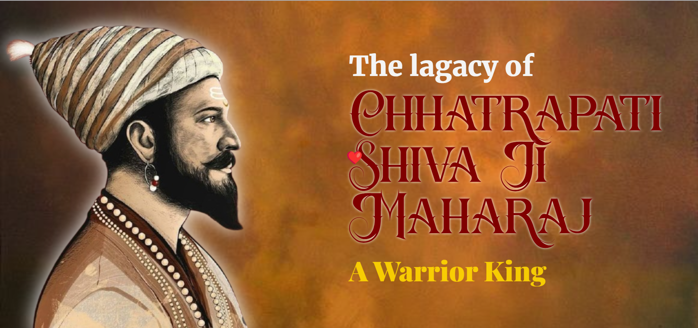

# ⚜️ Chhatrapati Shivaji Maharaj Tribute Page
## 📌 Table of Contents  
- [Introduction](#-introduction)  
- [Features](#-features)  
- [Technologies Used](#-technologies-used)  
- [Live Demo](#-live-demo)  
- [Preview](#-preview)  
- [How to Run Locally](#-how-to-run-locally)  
- [Future Enhancements](#-future-enhancements)  
- [Contributing](#-contributing)  
- [Acknowledgments](#-acknowledgments)  
- [About the Developer](#-about-the-developer)  


## 🌟 Introduction
This is a **tribute page** dedicated to the legendary warrior **Chhatrapati Shivaji Maharaj**, founder of the **Maratha Empire**. The page highlights his **life, achievements, and legacy**, showcasing his impact on Indian history. The project is designed with **modern web technologies**, including **HTML, CSS, JavaScript, GSAP animations**, and a **visually rich design** that captures the essence of his era.

## 📝 Features
- 🚩 **Royal Maratha Theme** inspired by the vibrant culture of the Maratha Empire.
- 🌌 **GSAP Animations** for smooth scrolling effects and interactive elements.
- 🔄 **Timeline Section** representing the major events of Shivaji Maharaj's life.
- 📸 **High-Quality Illustrations** including historical images and SVGs.
- 🏆 **Achievements Section** showcasing his military and administrative brilliance.
- 🌟 **Fort Representation** displaying the forts built and conquered by Shivaji Maharaj.

## 🛠️ Technologies Used
-  Structured content and semantic elements.
-  Styling and layout design.
-  Smooth animations and scroll effects.
-  Interactive functionalities.
- **SVG Icons & Emojis** - Enhancing the visual appeal.


## 🔗 Live Demo  
[](https://dothp-harshu.github.io/chhatrapati_shivaji_maharaj/)

## 🎥 Preview  



## 🎉 How to Run Locally
1. Clone this repository:
   ```bash
   git clone https://github.com/dothp-harshu/chhatrapati_shivaji_maharaj.git
   ```
2. Open `index.html` in your browser.
3. Enjoy the tribute page!

## 🌟 Future Enhancements
- ✨ More **historical references and facts** about Shivaji Maharaj.
- ✨ **Audio Narration** for a richer storytelling experience.
- ✨ Enhanced **GSAP animations** for a cinematic effect.
- ✨ More **Milestones in Shivaji Maharaj’s life**.


## ✨ Contributing
Feel free to contribute by suggesting improvements or adding new sections! Fork the repository and submit a pull request. 🚀

## 💙 Acknowledgments
Special thanks to **historical sources, SVG creators, and the open-source community** for resources that helped in building this tribute page.

## 💡 About the Developer
Hey there! 👋 I’m **Harsh Prajapati** ❤️, a passionate front-end developer with a love for web animations and interactive designs. This tribute page was built to honor the great **Chhatrapati Shivaji Maharaj**, using **GSAP, HTML, CSS, and JavaScript**. Hope you like it! 🚀

### 📬 **Let's Connect**
- **GitHub**: [dothp-harshu](https://github.com/dothp-harshu)  
- **Twitter/X**: [@btw_harsh_](https://instagram.com/btw_harsh_)  
- **Email**: harshprajapati3636gmail.com  

---

🚩 **"Jai Bhavani, Jai ShivaJi!"** 🚩

